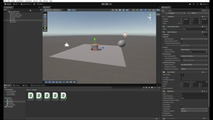
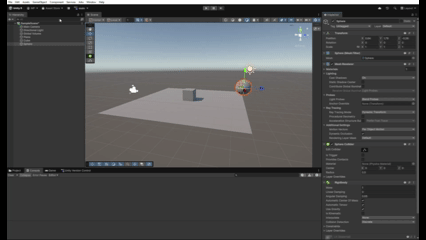
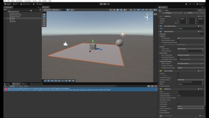
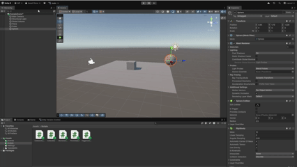
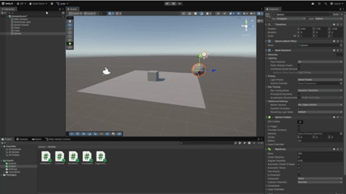
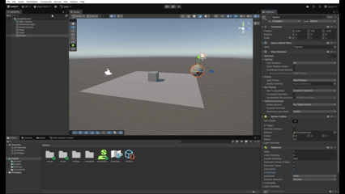
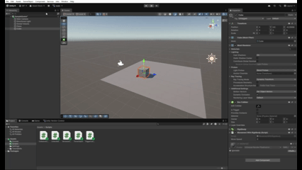
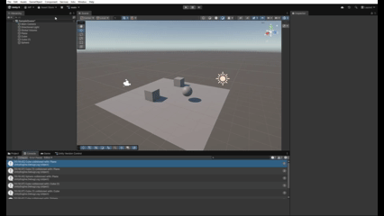
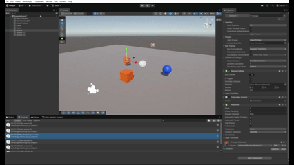

# Interfaces-Inteligentes-Practica-03

En esta práctica se llevan a cabo un total de 9 situaciones y 5 ejercicios en los que aprendemos las bases de las físicas en Unity.
A continuación veremos las distintas situaciones:

1. El plano no es un objeto físico. El cubo es un objeto físico y la esfera no. En este caso, el
plano y la esfera sólo tendrán collider, mientras que el cubo debe tener Rigidbody:
En esta situación nos encontramos que los objetos se encuentran inmóviles. Esto se debe a que el plano no es un objeto físico (no cae) y que el objeto físico (el cubo) está apoyado en el plano.

2. El plano no es un objeto físico. El cubo es un objeto físico y la esfera también. En este caso,
el plano sólo tendrán collider, mientras que el cubo y la esfera deben tener Rigidbody:
En esta situación el cubo permanece quieto mientras que la esfera cae sobre el plano, debido a que ambos son objetos físicos y a que la esfera no está inicalmente apoyada en el plano.

3. El plano no es un objeto físico. El cubo es un objeto físico y la esfera es cinemática. En este
caso, el plano sólo tendrán collider, mientras que el cubo y la esfera deben tener Rigidbody
esta última cinemático:
En esta situación la esfera no cae sobre el plano debido a que es cinemática, lo que significa que no le afectan fuerzas como la gravedad.

4.El plano es un objeto físico. El cubo es un objeto físico y la esfera es física. En este caso,
todos los objetos deben tener Rigidbody:
En esta situación toda la escena cae, al ser todo objetos físicos y ninguno cinemático.

5. El plano es un objeto físico. El cubo es un objeto físico y la esfera es física con 10 veces
más masa que el cubo. En este caso, todos los objetos deben tener Rigidbody:
Ocurre exactamente lo mismo que en el caso anterior.

6. El plano es un objeto físico. El cubo es un objeto físico y la esfera es física con 100 veces
más masa que el cubo. En este caso, todos los objetos deben tener Rigidbody:
Vuelve a ocurrir exactamente lo mismo. Esto se debe a que están en el vacío y no les afecta la fricción del aire, por lo que todos los objetos caen al mismo tiempo sin importar su masa.

7. El plano es un objeto físico. El cubo es un objeto físico y la esfera es física con fricción. En
este caso, todos los objetos deben tener Rigidbody:
Vuelve a ocurrir lo mismo que antes. No importa que la esfera tenga fricción ya que no hay aire con el que interactúe.

8. El plano es un objeto físico. El cubo es un objeto físico y la esfera no es física y es Trigger.
En este caso, todos los objetos deben tener Rigidbody.
En esta situación la esfera, al ser un objeto no físico, no cae al vacío.

9. El plano es un objeto físico. El cubo es un objeto físico y la esfera es física y es Trigger. En
este caso, todos los objetos deben tener Rigidbody:
Como la esfera vuelve a ser un objeto físico, todo el conjunto vuelve a caer al vacío.

A continuación veremos los ejercicios realizados, así como su respectiva ruta a sus scripts:

1. Crea un personaje,controla su desplazamiento con las teclas WASD o las
flechas, el movimiento debe estar influenciado por usando un Rigidbody, pero manteniendo
el control total:
[Script](Scripts/MovementWithRigidbody.cs)

2. Crea varios cubos o esferas con Rigidbody dinámico. Muestra por consola el
nombre del objeto con el que colisiona, y cámbiale su color al colisionar:
[Script](Scripts/ColissionAndColour.cs)

3. Crea una zona (por ejemplo, un cubo grande con Is Trigger = true). Al
entrar, cambia el color del personaje o activa un efecto que cambie la luz. Al salir, revierte el
cambio. Añade otra zona que aumente una variable daño:
[Script](Scripts/TriggerColour.cs)

4. Crea tres tipos de objetos en capas distintas: jugador, enemigos, recolectables.
Configura la Layer Collision Matrix (Project Settings > Physics). Haz que los enemigos
solo colisionen con el jugador, y que los recolectables solo sean detectados por triggers:
[Script](Scripts/Collectible.cs)

5. Crea una escena con distintos materiales físicos (resbaladizo, rugoso, rebote
alto). Aplica distintos Physic Materials a objetos. Lanza los objetos con AddForce() al
pulsar la tecla X y observa cómo cambian las reacciones:
[Script](Scripts/ThrowObject.cs)

12. Cubo mirando a la esfera siempre mirándola a ella:

13. Cubo avanzando hacia su "adelante" siempre mediante rotar su eje horizontal:

